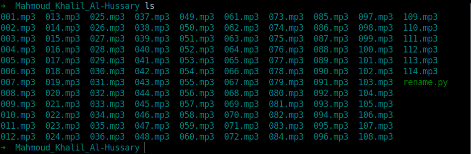
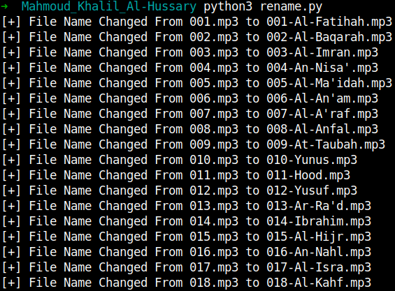
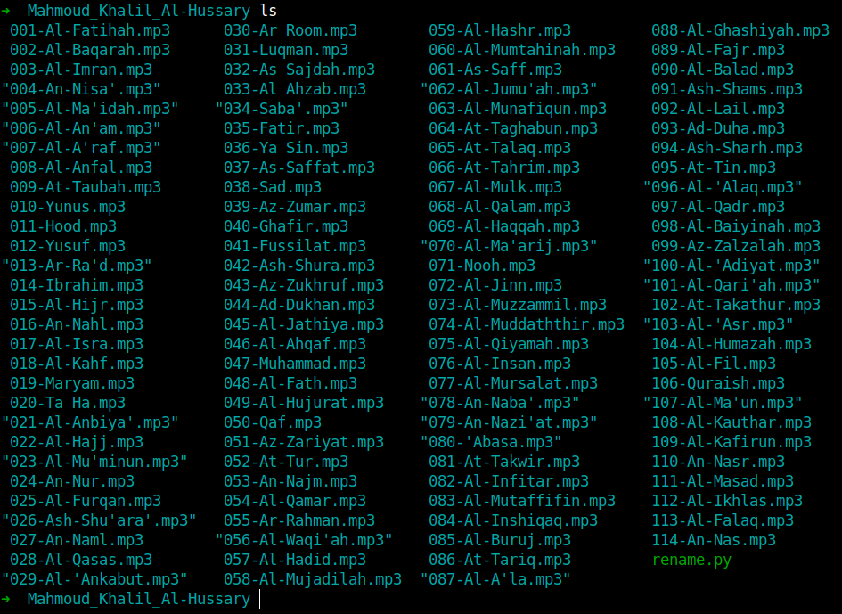

# Introduction

### Problem
After Downloading the Quran from [tvquran.com](https://tvquran.com/) it looks like that and I am not able to specify any sourh.




### Solution
I Notice that the name of each sourh is in the metadata so I have written this script to extract the name and rename it. 

# Getting Started
```
$ git clone https://github.com/m1m0n/Scripts.git
$ cd Scripts/rename
```

# Install requirements
```
$ pip3 install requirement.txt
```

# Usage
### Before 


### During



### After


